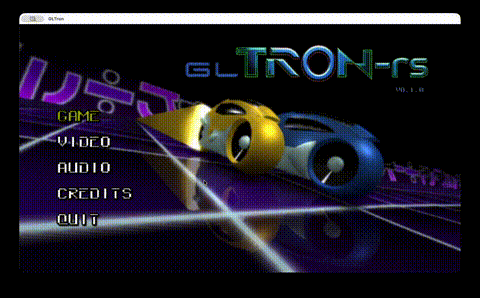
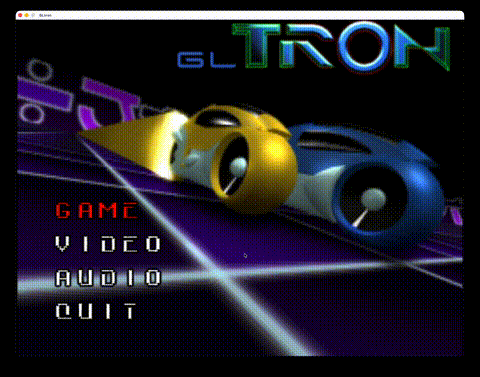

# GLTron-rs

A Rust rewrite of [GLTron](http://www.gltron.org/) 0.70 — the classic lightcycle game inspired by the 1982 film *TRON*.

In the world of TRON, programs take physical form inside the digital realm of The Grid. Lightcycle combat is the most iconic arena in this world — riders on blazing-fast cycles leave solid walls of light in their wake, turning the arena into a deadly maze. Your only goal: survive. Outmaneuver your opponents, force them into walls, and be the last rider standing.

GLTron brought this experience to the desktop as an open-source OpenGL game. **GLTron-rs** is a ground-up rewrite in Rust with modern OpenGL 3.3 Core (via [glow](https://github.com/grovesNL/glow)), targeting both desktop and web (WASM).

### [>>> Play it now in your browser <<<](https://gltron-rs.web.app/)

## GLTron-rs vs GLTron 0.70

**GLTron-rs (Rust rewrite)**



**GLTron 0.70 (Original)**



## Enhancements over GLTron 0.70

- Web version with mobile touch controls (WASM)
- Stencil-based planar reflections (missing in 0.70)
- HUD speedometer (similar to later versions of GLTron)
- Spectating view after death
- Game pause with key hints overlay
- In-game scoreboard (bindable key)
- Advanced settings panel — modifiable game rule parameters (wall acceleration, boost recovery, speed zones, etc.)
- Save/load settings as named Presets
- Game controller support

## TODO

- **Better AI** — current AI is functional but not fun; planning to train an ML model via reinforcement learning
- Improve game loop / polish game rule values
- Network / Internet multiplayer
- Explore ideas from the [original TODO list](http://www.gltron.org/) and later GLTron versions

## Desktop

```bash
cargo run --release
```

## Web (WASM)

### Prerequisites

```bash
rustup target add wasm32-unknown-unknown
cargo install wasm-bindgen-cli --version 0.2.108
cargo install miniserve
```

### Build & Serve

```bash
./web-run.sh restart   # build and start server on http://localhost:8080
./web-run.sh           # rebuild only (refresh browser to see changes)
./web-run.sh stop      # stop server
```

## License

This project is a derivative work of [GLTron](http://www.gltron.org/) by Andreas Umbach, originally released under the GNU General Public License.

Copyright (C) 2002 Andreas Umbach (original GLTron)
Copyright (C) 2025 Florin Bunau (Rust rewrite)

This program is free software; you can redistribute it and/or modify it under the terms of the [GNU General Public License, version 2](LICENSE) (or at your option any later version) as published by the Free Software Foundation.

See the [LICENSE](LICENSE) file for the full license text.
